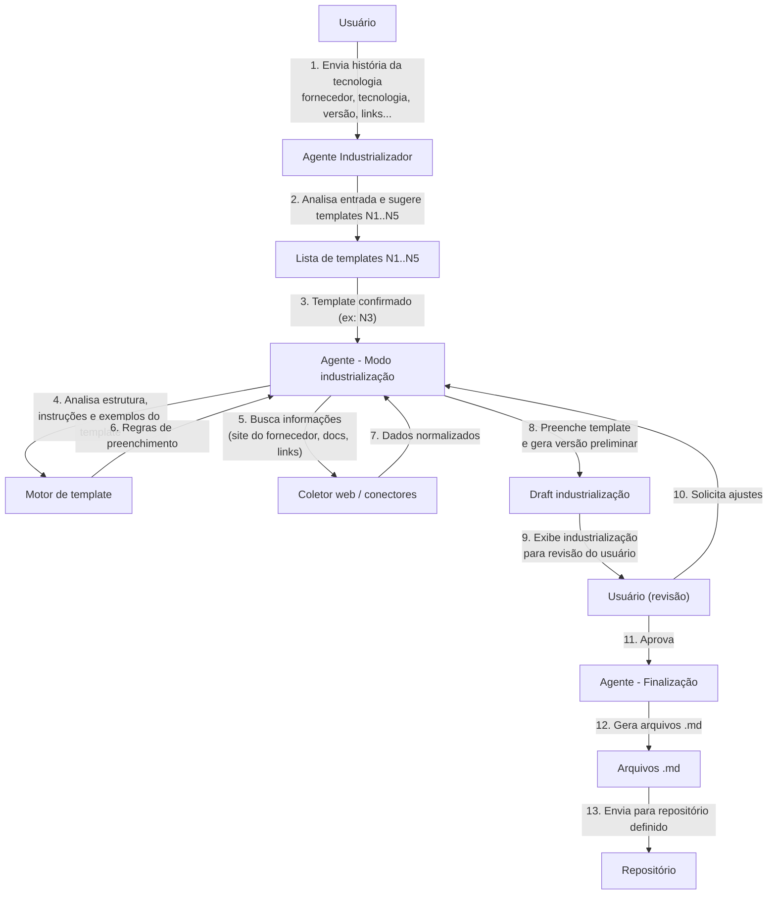

# Projeto Agente Industrializador – Proposta de Pré-venda

## 1. Visão Geral

O **Agente Industrializador** é um agente de IA especializado em transformar histórias de tecnologias em **documentação industrializada padronizada**, baseada em templates (N1 a N5) e publicada em arquivos **Markdown (.md)** em um repositório definido.

Ele automatiza o processo de industrialização, reduzindo esforço manual, erros e tempo de homologação, além de garantir padronização e rastreabilidade.

---

## 2. Contexto e Problema

Organizações que lidam com múltiplos fornecedores e tecnologias precisam industrializar constantemente:

- Novos fornecedores
- Novas tecnologias
- Novas versões de produtos já homologados
- Ajustes de padrões internos e templates (N1 a N5)

### Situação atual típica

- Processo manual com muito **“copiar e colar”** de sites, PDFs e documentos antigos
- Forte dependência de especialistas para escrever/ajustar a documentação
- Documentos heterogêneos, com **falta de padronização**
- Prazo elevado para concluir a industrialização de cada tecnologia
- Dificuldade para escalar o volume de tecnologias atendidas

---

## 3. Desafios que o Agente Endereça

- **Baixa produtividade**
  - Industrializar uma tecnologia consome horas ou dias de especialistas
- **Falta de padronização**
  - Cada analista escreve de um jeito, gerando inconsistência entre N1, N2, N3, N4, N5
- **Risco de erros e desatualização**
  - Copia e cola incorreto, documentação desatualizada do site do fornecedor
- **Dificuldade de escala**
  - Crescimento da base de tecnologias sem aumento proporcional da equipe
- **Baixa rastreabilidade**
  - Documentos dispersos, sem versionamento adequado, difícil saber a “fonte oficial”

---

## 4. Visão da Solução: Agente Industrializador

O **Agente Industrializador** atua como um “operador digital” especializado em industrialização:

- Entende a **história da tecnologia** informada pelo usuário
- Sugere e aplica **templates padronizados (N1 a N5)**
- Coleta dados diretamente em:
  - Site oficial do fornecedor
  - Links de documentação da tecnologia
  - Outros recursos indicados
- Preenche automaticamente o template selecionado, obedecendo:
  - Estrutura
  - Instruções de preenchimento
  - Exemplos oficiais
- Gera a **documentação final em arquivos `.md`**, pronta para:
  - Versionamento (Git, etc.)
  - Publicação em portais internos, wiki, sites de docs

Foco central em:

- **Padronização**
- **Escalabilidade**
- **Qualidade e consistência**
- **Rastreabilidade e automação ponta a ponta**

---

## 5. Fluxo Funcional do Agente Industrializador

Abaixo, o fluxo funcional baseado na jornada do usuário e do agente:

1. **Entrada da história da tecnologia**
   - O usuário fornece:
     - Nome do fornecedor
     - Nome da tecnologia
     - Versão
     - Links relevantes (documentação, release notes, etc.)
     - Observações e requisitos específicos

2. **Sugestão e seleção de template (N1 a N5)**
   - O agente analisa a entrada e lista os templates disponíveis (N1, N2, N3, N4, N5)
   - O agente pode destacar qual template é mais adequado, se aplicável
   - O usuário confirma o template desejado

3. **Análise do template escolhido**
   - O agente lê:
     - Estrutura do template
     - Instruções de preenchimento
     - Exemplos já aprovados (casos de referência)
   - Garante aderência às regras de negócio do cliente

4. **Coleta e organização das informações**
   - O agente começa a buscar informações:
     - No site do fornecedor
     - Nos links de documentação fornecidos
   - As informações são filtradas e organizadas de acordo com os campos do template

5. **Preenchimento automático do template**
   - O agente preenche o template seguindo:
     - Estrutura definida
     - Instruções detalhadas
     - Padrão de linguagem do cliente (quando configurado)
   - Gera uma **versão preliminar da industrialização**

6. **Revisão pelo usuário**
   - O agente exibe a industrialização preenchida ao usuário
   - O usuário pode:
     - Aprovar
     - Solicitar alterações, correções ou complementos

7. **Iteração (se necessário)**
   - Em caso de ajustes:
     - O agente refina o conteúdo de acordo com o feedback
     - Nova versão é apresentada para validação

8. **Aprovação e publicação**
   - Após a aprovação do usuário:
     - O agente gera os arquivos **.md** da industrialização
     - Envia automaticamente para o local definido:
       - Repositório Git
       - Pasta padrão
       - Outro destino configurado

---

## 6. Diagrama de Fluxo da Solução (Mermaid)

---

## 7. Componentes da Solução

### 7.1. Interface do Usuário

- Formulário para envio da história da tecnologia
- Tela/listagem de templates (N1 a N5) com descrição de uso
- Tela de revisão e aprovação da industrialização gerada
- Área de comentários/feedback (opcional)

### 7.2. Agente Industrializador (IA)

- Interpreta a história da tecnologia
- Sugere o template adequado (quando aplicável)
- Orquestra:
  - Coleta de dados
  - Análise de template
  - Preenchimento da documentação
  - Interações de revisão com o usuário

### 7.3. Módulo de Templates

- Catálogo de templates N1–N5 do cliente
- Estrutura de campos, seções e regras obrigatórias
- Instruções textuais para preenchimento
- Exemplos oficiais (documentos já aprovados)

### 7.4. Módulo de Coleta de Informações

- Conectores para:
  - Sites oficiais de fornecedores
  - Documentação pública (docs, wikis, etc.)
  - Links privados informados
- Normalização de texto e filtragem de conteúdo relevante

### 7.5. Módulo de Geração e Publicação de Artefatos

- Geração de arquivos em formato **Markdown (.md)**:
  - Um ou mais arquivos por template/nível
- Padrões de nomenclatura:
  - Ex.: `fornecedor-tecnologia-versao-N1.md`
- Envio dos arquivos para:
  - Repositório Git
  - Pasta compartilhada
  - Outro destino/configuração acordada

---

## 8. Benefícios para o Cliente

- **Produtividade**
  - Redução significativa do tempo de industrialização por tecnologia
- **Padronização**
  - Todas as industrializações seguem rigorosamente os templates N1 a N5
- **Qualidade**
  - Conteúdo consistente, com menos erros de cópia, versões e formatação
- **Escalabilidade**
  - Capacidade de atender um volume maior de tecnologias sem aumentar o time
- **Rastreabilidade**
  - Documentos em `.md` versionados com histórico completo de alterações
- **Governança**
  - Aplicação uniforme das regras definidas pelas áreas responsáveis (arquitetura, engenharia, segurança, etc.)

---

## 9. Casos de Uso Típicos

- Onboarding de **novos fornecedores** e **novas tecnologias**
- Atualização de **novas versões** de produtos já industrializados
- Criação rápida de documentação padronizada para:
  - Equipes de desenvolvimento
  - Operações / SRE / DevOps
  - Segurança / Compliance
- Revisão e reindustrialização da base instalada para adequação ao novo padrão de templates

---

## 10. Roadmap Evolutivo Proposto

### Fase 1 – MVP

- Suporte inicial a 1–2 templates (por exemplo N1 e N2)
- Coleta de informações principalmente via:
  - Site do fornecedor
  - Links informados pelo usuário
- Geração de arquivos `.md` em um repositório único/pasta padrão

### Fase 2 – Expansão

- Cobertura completa dos templates N1 a N5
- Suporte a múltiplos repositórios/destinos (Git corporativo, SharePoint, etc.)
- Ajustes finos de linguagem conforme o padrão e glossário do cliente
- Melhoria da experiência de revisão e aprovação

### Fase 3 – Otimização e Inteligência

- Métricas de:
  - Tempo médio de industrialização
  - Volume de tecnologias processadas
  - Taxa de retrabalho
- Sugestão automática do template mais adequado com base na história
- Aprendizado contínuo com feedback do usuário, refinando:
  - Regras
  - Prompts
  - Estilo de escrita

---

## 11. Diferenciais da Proposta

- Foco direto em **industrialização**, não apenas em “geração de texto”
- IA trabalhando **ancorada em templates, instruções e exemplos do cliente**
- Entrega final em **Markdown (.md)**, facilitando:
  - Versionamento
  - Integração com pipelines de publicação
- Arquitetura preparada para:
  - Evoluir com novos templates
  - Conectar novos fornecedores e fontes de dados
  - Integrar com o ecossistema de ferramentas já existente

---

## 12. Próximos Passos (Pré-venda)

1. **Alinhamento de requisitos**
   - Templates N1–N5 finais e exemplos oficiais
   - Padrões de linguagem, glossário e formatação
   - Repositório/destino oficial dos arquivos `.md`

2. **Prova de Conceito (PoC)**
   - Selecionar 1–2 tecnologias reais para industrialização piloto
   - Comparar:
     - Tempo atual x tempo com o Agente Industrializador
     - Qualidade percebida pelo time técnico

3. **Planejamento da implantação**
   - Escopo final da Fase 1 (MVP)
   - Cronograma
   - Modelo de contratação, suporte e evolução

---
